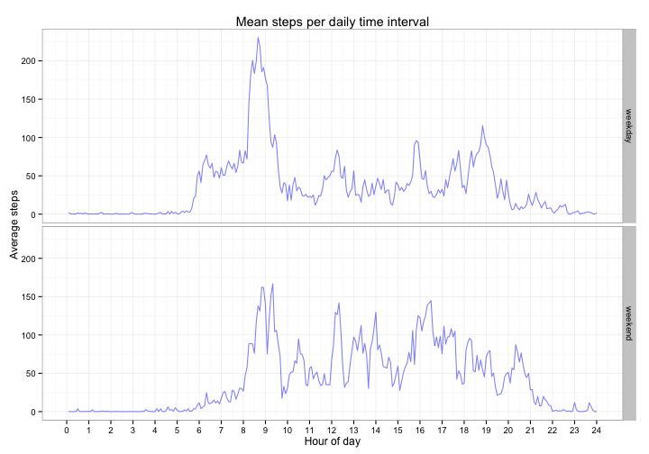

---
output:
  html_document:
    fig_caption: yes
    theme: spacelab
---
# Reproducible Research: Peer Assessment 1

## Loading and preprocessing the data

Data are compressed in a zip file. It will be uncompressed and loaded to a activity data frame.


```r
# Unzip activity.zip
unzip(zipfile = 'activity.zip')
# Load the csv
activity.raw = read.csv('activity.csv')
```

Explore data...


```r
# Load knitr to pretify outputs
require(knitr, quietly = T)
# Get a summary of data
kable(summary(activity.raw), format = 'markdown')
```


|   |    steps       |        date       |   interval    |
|:--|:---------------|:------------------|:--------------|
|   |Min.   :  0.0   |2012-10-01:  288   |Min.   :   0   |
|   |1st Qu.:  0.0   |2012-10-02:  288   |1st Qu.: 589   |
|   |Median :  0.0   |2012-10-03:  288   |Median :1178   |
|   |Mean   : 37.4   |2012-10-04:  288   |Mean   :1178   |
|   |3rd Qu.: 12.0   |2012-10-05:  288   |3rd Qu.:1766   |
|   |Max.   :806.0   |2012-10-06:  288   |Max.   :2355   |
|   |NA's   :2304    |(Other)   :15840   |NA             |


```r
# How are variables formatted?
str(activity.raw)
```

```
## 'data.frame':	17568 obs. of  3 variables:
##  $ steps   : int  NA NA NA NA NA NA NA NA NA NA ...
##  $ date    : Factor w/ 61 levels "2012-10-01","2012-10-02",..: 1 1 1 1 1 1 1 1 1 1 ...
##  $ interval: int  0 5 10 15 20 25 30 35 40 45 ...
```

- Column _date_ should be a date vector.
- Column _interval_ should be a categorical vector.
- NA's will mess up some calculations


```r
# Use a data frame with no NA's
activity = na.omit(activity.raw)
# Load lubridate for date manipulation
require(lubridate, quietly = T)
# Typecast 'date' to be a date (POSIX) vector
activity$date = ymd(activity$date)
# Typecast 'interval' to be a factor vector
activity$interval = as.factor(activity$interval)
# Check dataframe structure
str(activity)
```

```
## 'data.frame':	15264 obs. of  3 variables:
##  $ steps   : int  0 0 0 0 0 0 0 0 0 0 ...
##  $ date    : POSIXct, format: "2012-10-02" "2012-10-02" ...
##  $ interval: Factor w/ 288 levels "0","5","10","15",..: 1 2 3 4 5 6 7 8 9 10 ...
##  - attr(*, "na.action")=Class 'omit'  Named int [1:2304] 1 2 3 4 5 6 7 8 9 10 ...
##   .. ..- attr(*, "names")= chr [1:2304] "1" "2" "3" "4" ...
```

## What is mean total number of steps taken per day?


```r
# Load ggplot2 for graphics
require(ggplot2, quietly = T)
# Load dplyr for data manipulation
require(dplyr, quietly = T, warn.conflicts = F)
# Create a data frame with the sum of steps per day
activity.day = group_by(activity, date)
activity.day = summarise(activity.day, steps = sum(steps))
# Plot the histogram
ggplot(data = activity.day, aes(x = date, y = steps)) +
    ggtitle('Total Steps per Day') +
    xlab('Date') +
    ylab('Total Steps') +
    geom_histogram(stat = 'identity', fill = 'blue', alpha = 0.5) +
    theme_bw()
```

 

The **mean** total number of steps per day is 10766.1886792453.

The **median** total number of steps per day is 10765.

## What is the average daily activity pattern?

The graphics show hours of day instead of 5 minute time interval for the sake of interpretation since it is easier to understand what is 9.5 hours than number of minutes passed since midnight.


```r
# Create a dataframe with the mean steps per interval
activity.interval = group_by(activity, interval)
activity.interval = summarise(activity.interval, steps = mean(steps))
# Create a time-series with a ggplot2 line
ggplot(data = activity.interval, aes(x = as.numeric(interval) / 12, y = steps)) +
    ggtitle('Mean steps per daily time interval') +
    xlab('Hour of day') +
    ylab('Average steps') +
    geom_line(colour = 'blue', alpha = 0.5) +
    scale_x_continuous(breaks = 0:24) +
    theme_bw()
```

 

The maximum mean number of steps is at interval 835. This interval is equivalent to 8.6667 in hours of day.

## Imputing missing values

The number of records with missing data in the raw data is 2304. This accounts for 13.1148% of all records.

Missing data will imputed by calculating the rounded mean steps of 5 minute interval. The objective of rounding the mean is to keep the steps as integer.


```r
# Data frame for imputing NAs
activity.imp_na = activity.raw
# Typecast 'date' and 'interval' appropriately
activity.imp_na$date = ymd(activity.imp_na$date)
activity.imp_na$interval = as.factor(activity.imp_na$interval)
# For each row of the data frame
for(i in 1:nrow(activity.imp_na)){
    # If 'steps' of the current row is NA
    if(is.na(activity.imp_na$steps[i])){
        # Make 'steps' of the current row equal...
        activity.imp_na$steps[i] = 
            # ... to the rounded median of steps ...
            round(
                mean(
                    # ... filtering ...
                    filter(
                        # ... the same dataframe ....
                        activity.imp_na,
                        # ... where the interval is the same ...
                        interval == activity.imp_na$interval[i],
                        # ... but 'steps' are not NA.
                        !is.na(steps)
                    )$steps # This fetches the 'steps' column
                )
            )
    }
}
# Confirm no NAs are present
sum(!complete.cases(activity.imp_na))
```

```
## [1] 0
```

```r
# Group by and summarise the data frame with the sum of steps per day
activity.imp_na.day = group_by(activity.imp_na, date)
activity.imp_na.day = summarise(activity.imp_na.day, steps = sum(steps))
# Plot the histogram
ggplot(data = activity.imp_na.day, aes(x = date, y = steps)) +
    ggtitle('Total Steps per Day (computed NAs)') +
    xlab('Date') +
    ylab('Total Steps') +
    geom_histogram(stat = 'identity', fill = 'blue', alpha = 0.5) +
    theme_bw()
```

 

The **mean** total number of steps per day is 10765.6393442623.

The **median** total number of steps per day is 10762.

The imputation doesn't show a substancial difference in the mean and median of total steps. Only October 2nd and November 15th show very low numbers.

## Are there differences in activity patterns between weekdays and weekends?


```r
# Create a new factor with 'weekday' and 'weekend'
activity.imp_na$day = factor(ifelse(
    # If the weekday is 'Saturday' or 'Sunday'...
    weekdays(activity.imp_na$date) %in% c('Saturday', 'Sunday'),
    'weekend',  # ... it's weekend
    'weekday'   # ... if not, it's weekday
))
# Create a dataframe with the mean steps per interval
activity.imp_na.interval = group_by(activity.imp_na, interval, day)
activity.imp_na.interval = summarise(
    activity.imp_na.interval, steps = mean(steps)
)
# Plot the data
ggplot(
    data = activity.imp_na.interval,
    aes(x = as.numeric(interval) / 12, y = steps)
    ) +
    ggtitle('Mean steps per daily time interval') +
    xlab('Hour of day') +
    ylab('Average steps') +
    geom_line(colour = 'blue', alpha = 0.5) +
    scale_x_continuous(breaks = 0:24) +
    facet_grid(day~.) +
    theme_bw()
```

 

